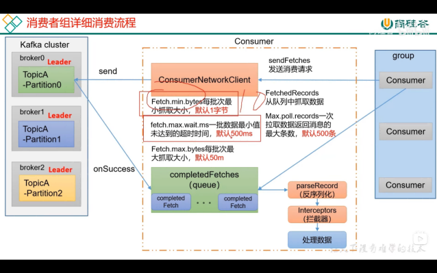
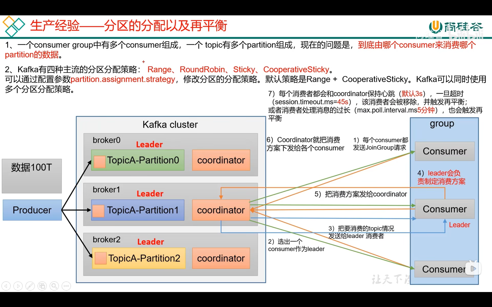
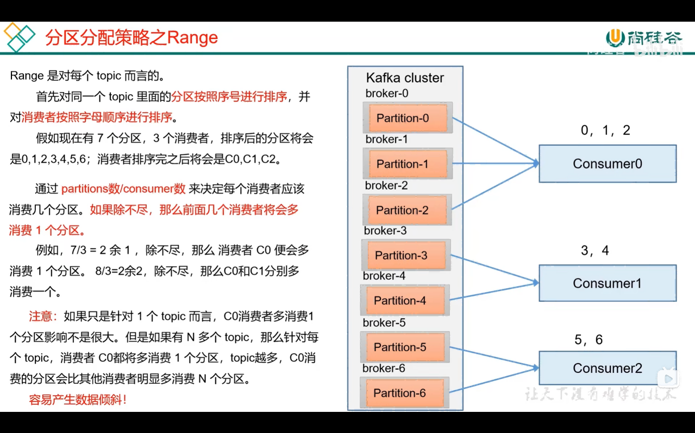
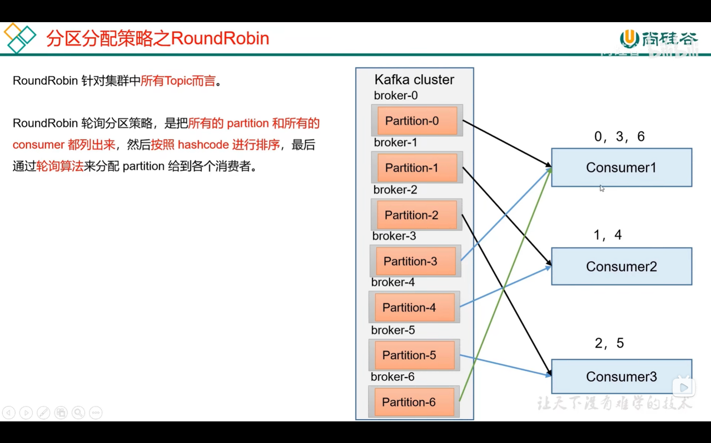
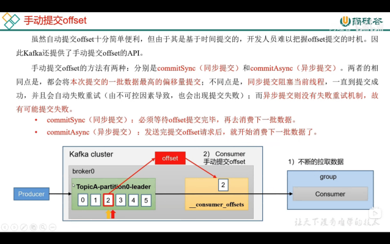
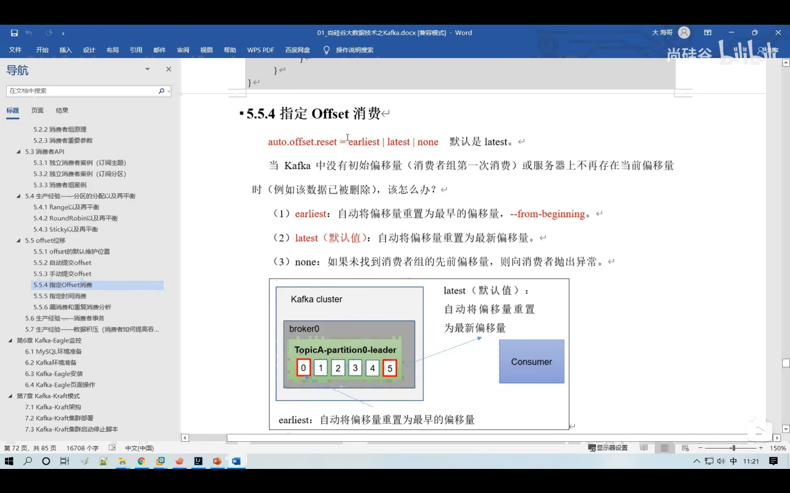
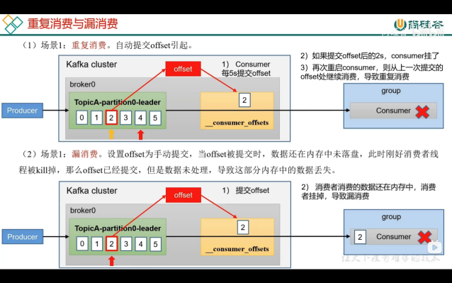
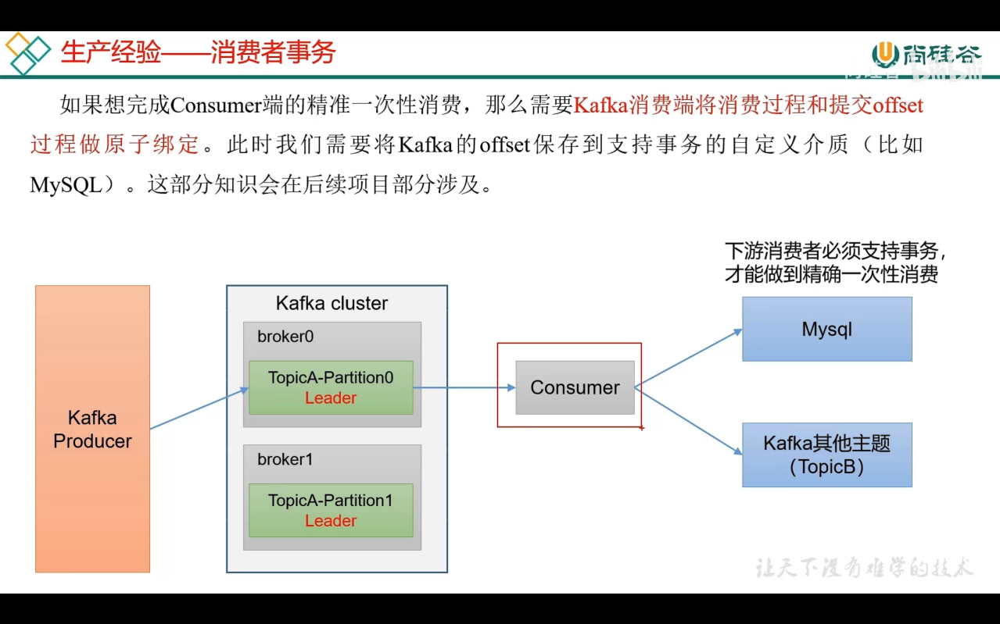
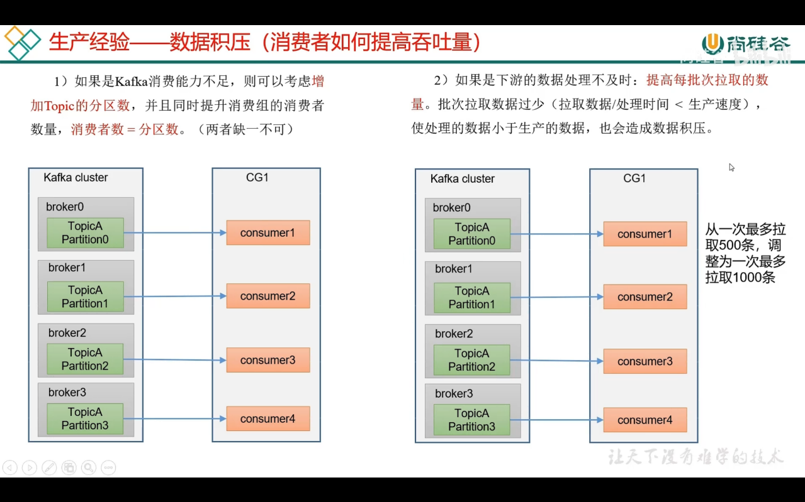

自动提交 默认 5s提交一次offest 有可能重复消费，因为offest可能还没提交，消费者挂了，已经消费过的数据又要被消费了

手动提交 有两种 ： 同步提交和异步提交

指定偏移量消费

消费者会产生的问题：

1、重复消费 自动提交引起的

2、漏消费 手动提交offset成功，结果消费者处理的数据还未完全落盘然后挂掉（也许落盘采用了子线程落盘数据呢），导致漏消费

怎么做到既不漏消费也不重复消费呢？

数据积压怎么办？
提高吞吐量 

增加分区，增加消费者 （最快速消费 消费者数 = 分区数）

提高每批次拉取的数据量

