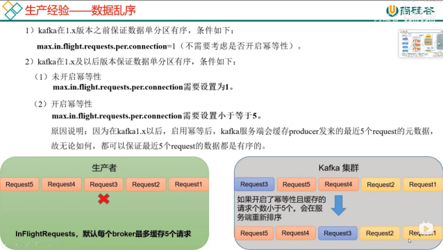

ack = 0 不适用 最多一次保证数据不重复，但是可能丢数

ack = 1 可以用来传输日志，日志丢了一点无所谓  可能丢失数据

ack = -1 用来做跟钱相关或者非常重要的数据，必须保证数据可靠性 至少一次保证数据不丢，但是可能数据重复

数据完全可靠性 = 生产者开启幂等 + ACK设置为-1 + 分区副本数>=2 + ISR应答数 >= 2 精确一次 保证不丢不重

也可能出问题，完全保证得用生产者事务

数据怎么保证可靠

数据怎么保证不重复

数据有序 单分区内有序，多分区无序，如果非要多分区有序，就一个消费者把数据拉下来重排序（效率慢），还不如全放在一个分区里保证数据有序

数据乱序--怎么保证数据有序
