Redis集群：
一、主从复制（一主多从）

读写分离，容灾快速恢复，Master写读(主要做写操作)/Slave只能做读操作

搭建：
三台机器：192.168.30.128:6379(主),192.168.30.129:6379(从),192.168.30.130:6379(从)

1、info replication查看节点信息

2、在从机上执行salveof <ip> <port>，ip、port为主机的IP和端口，代表这台redis从属于主机

在129和130上执行slaveof 192.168.30.128 6379

需要注意的是如果主机配置了密码，需要在从机上配置主机的密码，不然主机查询不了从节点信息，注意主节点128上也要配，因为哨兵模式重新选主，可能选到其他节点，每台机器都有可能成为从节点
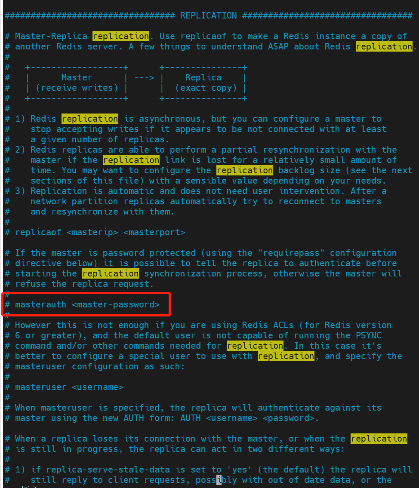

3、在主机上再info replication查看节点信息可以看到从节点信息
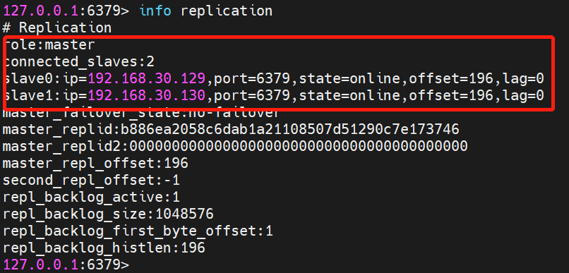

复制原理：
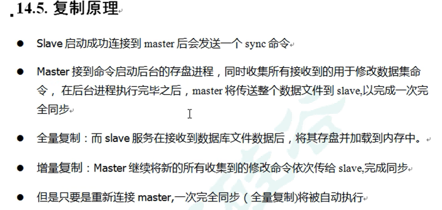

当从节点挂掉后重启，需要重新执行slaveof 192.168.30.128 6379，跟随主节点后，从节点会复制主节点所有的数据过来保持一致

（完全一致，不会多也不会少，就算重启后自己往这台挂掉的redis写入数据，后面一旦跟随主节点后，自己在这台redis新增的数据也会被干掉，需要跟主节点保持完全一致）

薪火相传
注意：从节点还可以有从节点，比如我在130上执行slaveof命令跟随129，但是我的129还是跟随128的，所以129依旧还是从节点，
只是129还有130的从节点，这样做的好处就是我的主节点128不需要通知130了，只去同步129，然后由129同步到130，可以降低主节点128的资源开销，
但是缺点就是如果129挂掉了，那么主节点128不会去同步到130，导致130不是最新的数据，130得等129复活后才能进行同步

当主节点挂掉后，从节点不会篡位，不会选主，主节点重启后仍然是主节点，从节点依然是从节点，缺点就是主节点挂掉的这段时间只能读从节点，不能进行写操作

当主节点挂掉后，我们自己可以主动选择一台从机执行slaveof no one命令将这台从机变为主机

反客为主
注意：假如主节点128挂了，这时候我在129执行slaveof no one，那么129将重新变成主节点，原主节点128的另一个小弟130还是在等待大哥128的复活，不会主动跟随新老大129，如果需要可以手动让130叛变

如果主节点挂了需要我们手动操作，比如主节点挂了重启主节点或者另选主节点，然后手动让其他从节点重新跟随新主节点，这样很不方便，下面哨兵就可以实现自动化选主

二、带哨兵的主从复制
redis提供了启动哨兵的命令还有配置文件
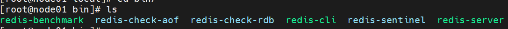

在主节点128上开启1个哨兵
1、先将安装目录下的sentinel.conf配置文件复制到/etc目录下
2、修改复制的配置文件的启动为后台启动，并修哨兵监听的主节点的IP，还有选主操作至少要几个哨兵同意才可以（后面有个数字是这个意思）
注意：如果主节点有密码，哨兵的密码必须也要配上主节点的密码，从节点的密码也要和主节点保持一致，不然哨兵检测不到从节点
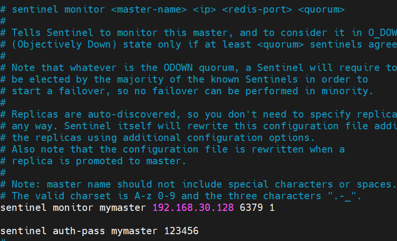
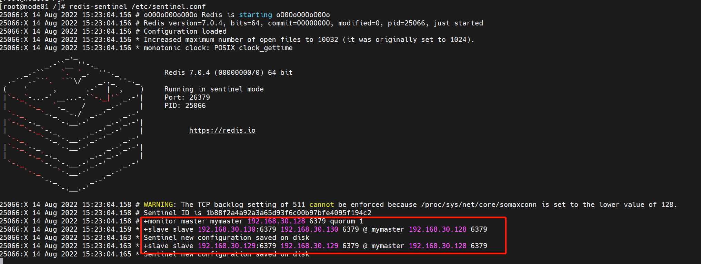
3、执行命令

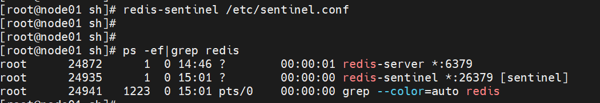

注意：哨兵一直在监测主节点，我设置的是1，只要有1个哨兵监测到主节点挂掉了，就会选主，如果有多个哨兵，假如5个哨兵，主节点128挂掉了，5个哨兵从129和130二选一选主，少数服从多数，哨兵/从节点个数得是奇数，不然两边投票选出来票数一样出现脑裂
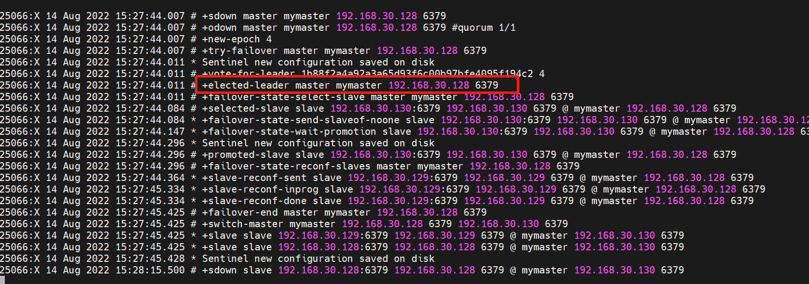
结果主节点128挂掉了，1个哨兵选举了130成为新主节点，此时129也会跟随新主130，然后重启128节点，这时128成为了小老弟，变成了从节点，跟随新主130节点

注意：哨兵虽然一开始监听的是128主节点，但是128挂掉选出了130主节点，哨兵就会监听130了，当130再挂掉，会再选举出129，因为128和130都挂了，如果129再挂掉，那么整个redis集群不可用
所以当节点挂掉后一定要及时重启，这样就算129挂掉了，也能继续再从128和130里面选主
在哨兵模式下，选出新主后，重启挂掉的节点，不需要再执行slaveof了，因为这件事哨兵帮我们做了，如下

最后选出128再次成为新主，重启129和130，哨兵会把它两变为从节点
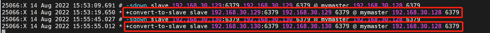
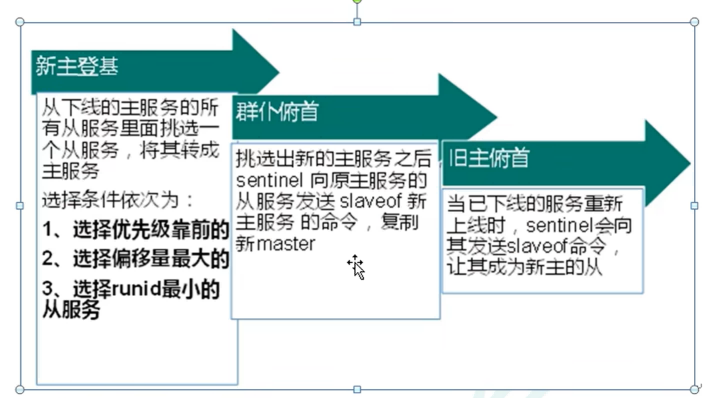

其次，我们可以控制选主的优先级，在redis.conf配置文件中，replica-priority（默认100），值越小选主优先级越高，但是如果为0，则永远不会被哨兵选中
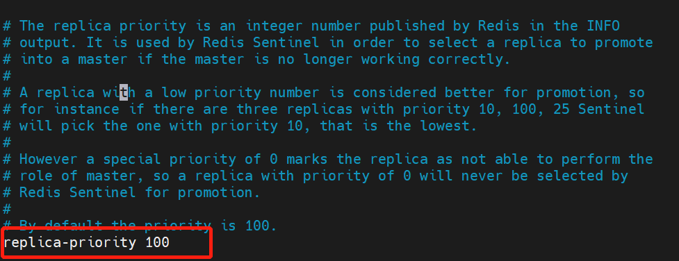

对应Java的使用
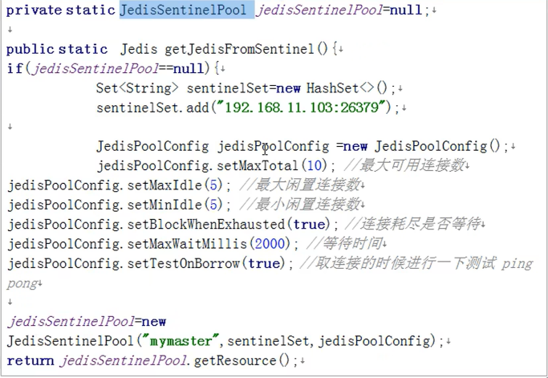

三、分片集群（多主从复制）